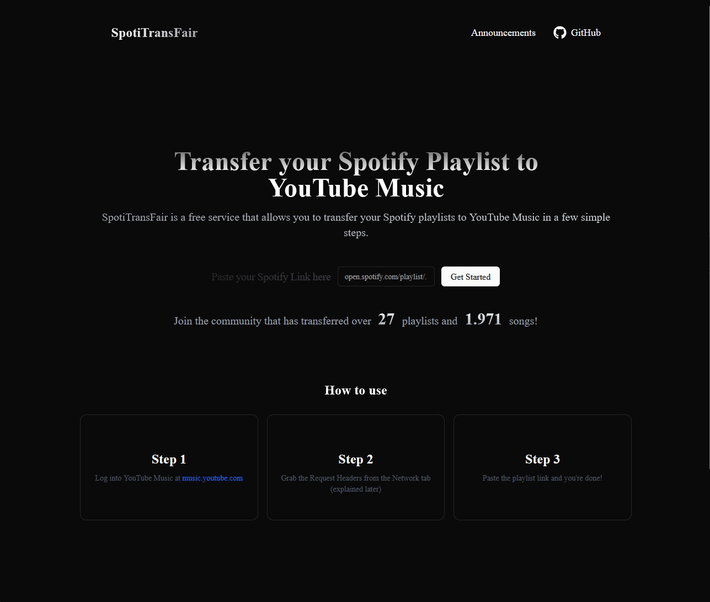

# SpotiTransFair

[](https://www.docker.com/)
[](https://www.gnu.org/licenses/)
[](https://github.com/niscz/SpotiTransFair)

Transfer your Spotify playlists to YouTube Music or TIDAL with a secure, high-performance, and self-hostable application that includes an operational dashboard with interactive analytics.


_The homepage of the application._


_The main interface for creating a playlist._

## 🚀 Key Features

- **Seamless Playlist Transfer**: Convert any public Spotify playlist to a new **or existing** YouTube Music or TIDAL playlist.
- **Fast & Efficient**: Parallelized track searches with a **configurable threadpool** and **global rate limiter** to stay within API limits.
- **Private & Secure by Design**:
  - Playlists can be **PRIVATE** (default), **UNLISTED**, or **PUBLIC**.
  - Your YouTube Music auth headers are processed **in-memory** per request and never persisted to disk.
- **Region-Aware Market Selection**: The UI proposes a market based on your **browser language** (no IP calls). You can override at any time.
- **Detailed Reporting**: Missed tracks and duplicates report. Retry dialog with **filter (Songs/Videos/Uploads)** and **Top-5 suggestions** to add directly.
- **Interactive Ops Dashboard**: Animated charts for status mix, daily import volume, provider share, and match quality, plus searchable tables for recent imports.
- **Dockerized for Easy Deployment**: One command to bring up the entire stack (Frontend + Backend, Nginx reverse proxy).
- **Modern & Robust Tech Stack**: Tabler UI templates on FastAPI, with resilient batching and retries.

## 🌱 Project Evolution: From Concept to Production-Ready

This project has been refactored, secured, and dockerized into a robust, scalable, and self-hostable application that follows modern DevOps and software engineering best practices.

### Key Improvements Made

-   **🚀 Performance Overhaul**:
    -   **Asynchronous Architecture**: Replaced the original synchronous Flask development server with a production-grade Gunicorn setup using modern `Uvicorn` ASGI workers.
    -   **Parallel Track Searching**: Implemented `concurrent.futures` to search for all playlist tracks simultaneously.
    -   **Resilient Batching**: Tracks are added to YouTube Music in resilient, split-and-retry batches to handle API errors gracefully.

-   **🛡️ Security Hardening**:
    -   **Solved Critical Race Condition**: Eliminated bugs where simultaneous requests could leak data by removing shared file-based authentication.
    -   **Secure In-Memory Handling**: User authentication headers are handled securely for each request temporarily in RAM-FS and is deleted after use.
    -   **Non-Root Containers**: Backend container runs as a non-root `appuser` for improved security. Frontend uses the official Nginx container (root in container) 
    -   **Robust Error Handling**: Secure error handling prevents leaking internal server details to the client.

-   **🐳 Full Dockerization & DevOps**:
    -   **One-Command Setup**: The entire application is containerized and managed with Docker Compose.
    -   **Multi-Stage Dockerfiles**: Produces minimal, optimized, and more secure production images.
    -   **Nginx Reverse Proxy**: A production-standard Nginx reverse proxy serves the frontend and securely routes API traffic to the backend.
    -   **Health Checks & Restart Policies**: Services include health checks and `restart: unless-stopped` policies for high availability.

## 🤔 Why a Header-Based Approach? A Note on APIs

A common question is, "Why not use the official YouTube API with a simple OAuth login?"

The official way to interact with YouTube is through the **YouTube Data API v3**. While excellent, its free tier is governed by a strict quota system.

-   **Daily Quota**: 10,000 units per day.
-   **Cost of Operations**: A single song search costs **100 units**, and adding a song costs **50 units**.

A single 50-song playlist would consume **7,500 units** (75% of the daily free quota), making it impossible to offer a reliable, free public service. This header-based approach, while less user-friendly upfront, allows **SpotiTransFair** to remain completely free and unlimited.

## 🛠️ Getting Started (Installation)

With Docker, getting SpotiTransFair running is incredibly simple.

### Prerequisites

-   [Git](https://git-scm.com/)
-   [Docker](https://www.docker.com/get-started) & [Docker Compose](https://docs.docker.com/compose/install/)

### 1. Clone the Repository

```bash
git clone https://github.com/niscz/SpotiTransFair.git
cd SpotiTransFair
```

### 2. Configure Environment Variables

1.  **Create a `.env` file** from the example:
    ```bash
    cp .env.example .env
    ```
2.  **Get Spotify Credentials** from the [Spotify Developer Dashboard](https://developer.spotify.com/dashboard/) by creating a new App.
3.  **Edit the `.env` file** and add your credentials. You can also customize other behaviors here.

### 3. Build and Run with Docker Compose

This command builds the production-ready images and starts both services.

```bash
docker-compose up --build
```

### 4. Access the Application

Once the containers are running, open your web browser and navigate to:

-   **➡️ `http://localhost:8001`**

-   Backend API: available at `/api`

## 📖 How to Use the App

1.  **Sign in** to [YouTube Music](https://music.youtube.com/) in your browser.
2.  **Get Auth Headers** (the UI has a step-by-step guide): Open DevTools → Network tab, filter for `/browse`, find a valid POST request, and copy the **Request Headers**.
3.  **Validate Headers**: button in the UI – quick sanity check.
3.  **Provide Spotify Playlist**: Paste the public URL of the Spotify playlist you want to transfer.
4.  **Choose Options**:
    -   **Market**: Affects Spotify search results (defaults to a best-effort guess of your region).
    -   **Privacy**: Sets the visibility of the new YouTube Music playlist (**PRIVATE** by default).
    -   **Update existing** (optional): paste a YouTube Music playlist URL/ID to append only missing tracks.
5.  **Connect & Clone**: Click "Connect" to check the backend status, then "Clone Playlist" to start.
6.  **Done!**: A dialog will show the results, including any tracks that couldn't be found. The dashboard provides interactive charts and searchable tables for operational insights (YouTube Music and TIDAL supported).
7.  **Retry**: For missed tracks, use the dialog to adjust query, change filter (Songs/Videos/Uploads), see Top-5 suggestions, and add directly to the created/selected playlist.

## ⚙️ API for Self-Hosters

-   `GET /api/`: Health check. Returns `{"message": "Server Online"}`.
-   `POST /api/validate-headers`: Body: `{ "auth_headers": "<raw string|dict>" }` → `{ "valid": true|false, "message": "..." }`
-   `GET /api/spotify/preview?playlist_link=...&market=US` → `{ "name": "...", "track_count": 123 }`
-   `POST /api/create`: The main endpoint for creating playlists.
    Body:
    ```json
    {
        "playlist_link": "https://open.spotify.com/playlist/...",
        "auth_headers": "<raw string of headers>",
        "market": "US",
        "privacy_status": "PRIVATE"
    }
    ```
    → `{ "message": "...", "missed_tracks": { ... }, "playlist_id": "...", "playlist_url": "..." }`
-   `POST /api/ytm/search`
    Body:
    ```json
    {
        "query": "Artist - Title", 
        "auth_headers": "...", 
        "filter": "songs|videos|uploads", 
        "top_k": 5 
    }
    ```
    → `{ "results": [ { "videoId":"...", "title":"...", "artists":[...] }, ... ] }`
-   `POST /api/ytm/add`
    Body:
    ```json
    { 
        "playlist_id": "PL...", 
        "video_id": "abc123", 
        "auth_headers": "..." 
    }
    ```
    → `{ "ok": true }`
-   `GET /api/stats`
    → `{ "playlists": n, "songs": m }`

## 🔧 Environment Variables

| Variable                 | Default                 | Description                                  |
| ------------------------ | ----------------------- | -------------------------------------------- |
| `DEFAULT_SPOTIFY_MARKET` | `US`                    | Fallback search market for Spotify           |
| `YTM_BATCH_SIZE`         | `60`                    | Items per add-batch to YTM                   |
| `YTM_SLEEP_SECS`         | `0.3`                   | Sleep between batches/splits                 |
| `YTM_POST_CREATE_SLEEP`  | `1.0`                   | Delay after playlist creation before inserts |
| `YTM_SEARCH_WORKERS`     | `8`                     | Threadpool size for parallel search          |
| `YTM_QPS`                | `5`                     | Global token-bucket QPS per process          |
| `TIDAL_COUNTRY_CODE`     | `US`                    | Country code for TIDAL API requests          |
| `STATS_FILE`             | `/data/stats.json`      | Persisted counters                           |
| `WEB_CONCURRENCY`        | `3`                     | Gunicorn workers (backend)                   |
| `FRONTEND_URL`           | `http://localhost:5173` | CORS origin (dev only)                       |

**Note:** Rate limiting is **per process**. If you run multiple Gunicorn workers, the token bucket applies **per worker** (which is fine for self-hosting).

## 🧠 Known Limitations

- **Auth headers can expire:** If a search returns 0 results, first re-check your YouTube Music headers.
- **Regional availability:** Some tracks aren’t available on YTM/Spotify in all regions or only under different artist/release metadata.
- **Private Spotify playlists:** Not readable with Client-Credentials flow (playlist must be **public**).
- **Best-effort rate limit:** A global token bucket per process; hard platform limits are not publicly documented.

## 🐳 Dev Setup (without Docker)

Optional:

1.  Backend:
    ```bash
    cd backend
    python -m venv .venv && source .venv/bin/activate
    pip install -r requirements.txt
    export WEB_CONCURRENCY=1
    python -m uvicorn main:app --host 0.0.0.0 --port 8001
    ```

2.  Frontend: The UI is served directly by the FastAPI backend (Jinja2 templates + Tabler assets), so no separate frontend dev server is required.

## 📄 License

This project is licensed under the **GNU General Public License v3.0**. See the [LICENSE](LICENSE) file for the full license text.

## 🙏 Acknowledgments

-   Thanks to the open-source community for the libraries and tooling used in this project.
